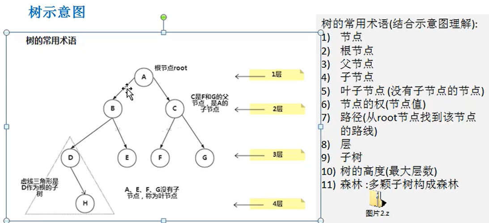
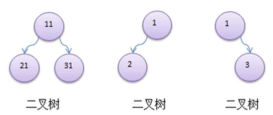
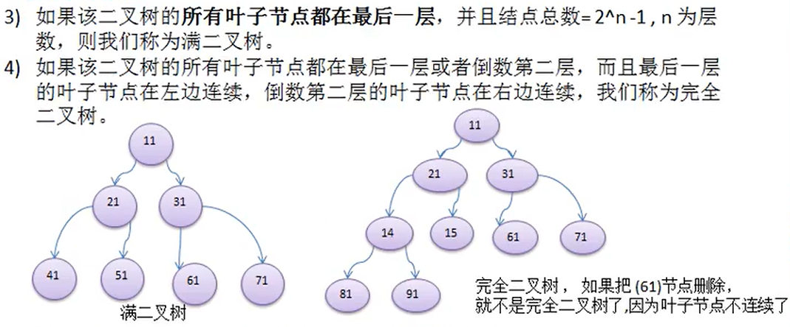

# 一、为什么需要树这种数据结构？
## 1)数组存储方式的分析
- 优点：通过下标方式访问元素，速度快。对于有序数组，还可使用二分查找提高检索速度。
- 缺点：如果要检索具体某个值，或者插入值(按一定顺序)会整体移动，效率较低

## 2)链式存储方式的分析
- 优点：在一定程度上对数组存储方式有优化(比如：插入一个数值节点，只需要将插入节点，链接到链表中即可，
删除效率也很好)。
- 缺点：在进行检索时，效率仍然较低，比如(检索某个值，需要从头节点开始遍历)

## 3)树存储方式的分析
能提高数据存储，读取的效率,比如利用二叉排序树(Binary      Sort Tree)，既可以保证数据的检索速度，同时也
可以保证数据的插入，删除，修改的速度。
# 二、树的常用术语

# 三、二叉树
- 1、树有很多种，每个节点最多只能有两个子节点的一种形式称为二叉树。
- 2、二叉树的子节点分为左节点和右节点
___

# ArrayList和LinkedList对比？
- 1、对于随机访问get和set，ArrayList优于LinkedList，因为LinkedList要移动指针。 
- 2、对于新增和删除操作add和remove，LinedList比较占优势，因为ArrayList要移动数据。
